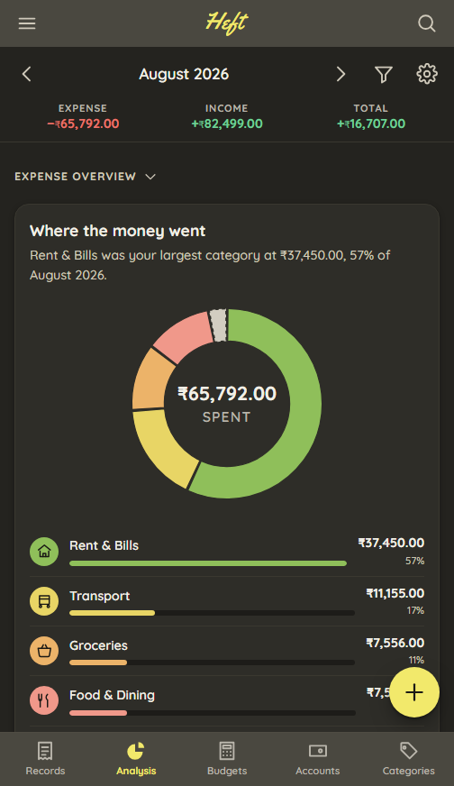
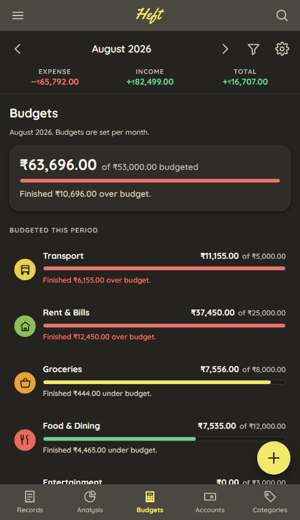
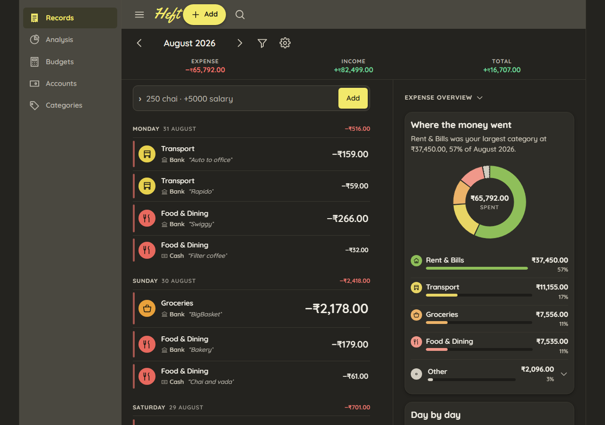

# Heft

An expense manager where money has mass — the heavier the spend, the heavier the row.

Single user, offline, INR, no accounts to create and no server to talk to. HTML, CSS and
JavaScript, with no build step and no dependencies.

**[Live demo →](https://samarth5704.github.io/heft/)**

<!--
  Screenshots are of the running app on the sample ledger, which is deterministic
  from a fixed seed, captured headlessly so no browser chrome is in the frame:

    chrome --headless=new --hide-scrollbars --window-size=W,H \
           --user-data-dir=<profile> --screenshot=<file> <url>

  All four are August 2026 — a whole month, where September is one day — in dark theme.

  records.png and desktop.png are captured with HEFT VIEW ON, which is NOT the
  default. A visitor to the live demo gets it off. That is deliberate: the mode is
  the idea the project is named for and it does not photograph at all when it is
  off. If you regenerate these, seed with heft=on and keep the alt text and the
  note under the table describing the on state — do not quietly let it flip back
  to the default and leave the caption describing something else.

    docs/screenshots/records.png     504x872   #/records?period=2026-08
    docs/screenshots/analysis.png    504x872   #/analysis?period=2026-08&view=expense
    docs/screenshots/budgets.png     504x872   #/budgets?period=2026-08
    docs/screenshots/desktop.png    1280x900   #/records?period=2026-08  (split layout)

  504 rather than a phone's 390: Chrome clamps a headless window to a 504px
  minimum width, and anything narrower is captured by cropping the render rather
  than by laying it out narrower. 504 is still well inside the 720px breakpoint,
  so it is the phone layout either way.

  Because August is a past month, the budget rows report what happened
  ("Finished ₹444.00 under budget") rather than showing a pace mark, which only
  appears on a month still in progress.
-->

| Records | Analysis | Budgets |
| --- | --- | --- |
|  |  |  |



The ledger above is in **Heft view**, where a row's height and its amount's size both
scale with the amount. It is a toggle in Preferences and it is **off by default** — the
live demo opens without it. Off, the weight is still there but quieter: it shows in the
spine down the left of each row and in the boldness of the amount, which keeps a long
ledger scannable. On is the full topographic mode, and it is the one worth a screenshot.

---

## Running it

ES modules will not load from `file://`, so it needs a server:

```bash
python3 scripts/serve.py 8123
```

Then open <http://localhost:8123>. On the Records tab, **Fill it with sample data** gives
you three months of plausible Indian spending across three accounts.

`scripts/serve.py` is `http.server` with caching turned off. Any static server works, but
the plain one sends no cache headers, so while editing you will be served a module graph
from ten minutes ago and spend a while debugging a bug you already fixed.

Nothing in the app depends on it. There is still no build step.

## Tests

973 assertions, no framework and no mocking — every function under test is pure and takes
its inputs explicitly, including "today". Open `tests.html` over HTTP for a pass/fail list
in the browser, or run the identical suite headlessly:

```bash
node --experimental-default-type=module scripts/run-tests.mjs
```

**[Run the suite on the live site →](https://samarth5704.github.io/heft/tests.html)** — the
same 973 assertions, in your browser, no install. It is published on purpose rather than by
accident: the suite drives the store through an in-memory `fakeStorage()`, never the real
one, so running it cannot read, change or delete a ledger you already have in that browser.

The palette is checked the same way, against the shipped stylesheet rather than a copy of
the values kept beside the test:

```bash
node --experimental-default-type=module scripts/check-contrast.mjs
```

## Using it

Type into the line at the top and press Enter:

| You type | Heft records |
| --- | --- |
| `250 chai` | ₹250 expense, today, Food & Dining, note "chai" |
| `chai 250` | the same — amount position is free |
| `1.2k rent` | ₹1,200, Rent & Bills |
| `1.5l deposit` | ₹1,50,000 |
| `+85000 salary` | ₹85,000 **income**, Salary |
| `2000 bank to cash` | a ₹2,000 **transfer** between two of your accounts |
| `swiggy 480 yesterday` | ₹480, yesterday, Food & Dining, note "swiggy" |

A live preview under the input shows what it parsed before you commit it. The **+** button
opens the full form, which has the same three kinds behind a segmented control.

| Key | Does |
| --- | --- |
| <kbd>/</kbd> | Jump to the quick-add line |
| <kbd>N</kbd> | Open the full form |
| <kbd>Esc</kbd> | Close any sheet, returning focus where it came from |

The whole view lives in the URL — tab, period, view mode, filters and search — so
`#/analysis?view=net&mode=yearly` is a link you can keep.

## The five tabs

**Records** is the ledger, grouped by day, with the period's expense, income and net
across the top. **Analysis** draws four charts under one expense / income / net switch.
**Budgets** paces this period's spending against a monthly plan. **Accounts** derives every
balance and your net worth. **Categories** keeps expense and income kinds apart.

The drawer holds Preferences and the data tools: **Export Report** (a JSON backup, or CSV
for a spreadsheet), **Backup & Restore** (import with a preview and an explicit merge or
replace), and **Delete & Reset**.

## On a laptop

Mobile-first, and it stays that way on a phone: a bottom tab bar, one column, a floating
add button. It does not stay that way on a laptop.

| Width | Layout |
| --- | --- |
| below 720px | bottom tab bar, single column, floating add button |
| 720px and up | the tab bar becomes a persistent labelled sidebar; the add button moves into the header |
| 960px and up | Records grows a second column holding its breakdown, so the ledger and its shape are readable together |
| 1200px and up | the measure stops growing and centres |

Those four are viewport queries, and they decide only where the furniture goes. What a
component does with the width it is *given* is a container query, so the ledger row reflows
because its own column is narrow rather than because the window is — which is what lets one
row component work full-width on a phone and in a 300px companion column on a laptop with
no second set of rules.

---

## Design notes

### Amounts are positive; direction is a separate field

A transaction stores a positive `amountPaise` and a `direction` of `'expense'` or
`'income'`. Never a signed amount.

A signed amount looks tidier and quietly destroys the ability to validate anything. Once
sign carries meaning, `−500` and `500` are both "valid" and the validator can no longer
reject a negative, so a minus sign introduced by a bad parse, a bad import or a typo
becomes indistinguishable from a deliberate income. Keeping amounts positive means
`toPaise()` rejecting a negative is load-bearing: there is no legitimate way for a negative
amount to exist anywhere in the system, so any negative is a bug and gets caught at the
boundary rather than turning up months later inside a total.

Signing happens once, at the aggregation boundary, where the code asks what it is summing
and gets an explicit answer. It is one place to get right instead of everywhere.

### Transfers are never income and never expense

Moving ₹2,000 from your bank to your wallet does not make you ₹2,000 poorer, and it does
not make you ₹2,000 richer. It changes nothing about what you earned or what you spent.

So a transfer is its own `kind`, and **any total that includes one is a bug.** That rule is
easy to state and easy to violate by accident, because the natural shape of the code —
`sum(transactions)` — violates it silently and produces a plausible wrong number. A month
total inflated by your own savings transfer looks exactly like a month you spent more.

Two things keep it honest. `analytics.viewAmount` is the single place the rule lives for
every series, so the donut, the daily bars, the six-period comparison and the day-cost
figures cannot disagree about it. And the suite asserts the invariant directly rather than
checking outputs one at a time: adding a transfer to a random ledger must leave every
expense figure, every income figure and every day-header net **bit-identical**, while
moving exactly two account balances by exactly ±the amount.

A transfer is also the reason the CSV export has a `Type` column. A spreadsheet that sums
the whole `Amount` column gets a number that means nothing, so the export makes you say
which rows you meant.

### Account balances are derived, never stored

A balance is `openingBalance + everything that has happened to the account`, computed on
read. There is no `balance` field, and nothing is ever incremented in place.

A stored balance is a second source of truth for a fact the transactions already contain,
and the two only have to disagree once. Every mutation becomes two writes that must both
succeed — edit an amount, delete a record, undo that delete, import a file, merge a
category — and the one path that forgets leaves a number that is wrong and stays wrong,
with nothing to compare it against. Deriving it means a balance cannot drift, because there
is nothing for it to drift *from*; a bug in the derivation shows up everywhere at once
instead of hiding in one account.

It costs a sum over the ledger on each read, which at the scale of one person's spending is
not a cost. The test that matters is the trivial one: an account with no transactions has a
balance of exactly its opening balance, counted once and not twice.

### The percentile-log weight scale, and the Heft view toggle

This is the whole project, so it is worth being precise about.

Linear scaling fails immediately. Rent is roughly 400× a chai, so on a linear ramp
everything that is not rent collapses into the same invisible weight — one tall row and
thirty-nine identical stubs. Ranking instead throws away magnitude: a ₹300 lunch and a
₹3,000 flight end up one step apart.

So each amount is mapped **logarithmically** onto `[0, 1]` between the **5th and 95th
percentile of the currently visible set**, then clamped:

```
t = (log(amount) − log(p5)) / (log(p95) − log(p5))
```

Percentile bounds rather than min and max mean one ₹80,000 outlier cannot crush the rest of
the list into nothing. Clamping rather than extending means that outlier still reads as the
heaviest thing on screen. An empty set, a single expense and a set of identical amounts all
resolve to `t = 0.5` — a middle weight, never a division by zero.

Because the bounds come from the **visible** set, the topography re-normalises on every
filter change. On one run of the sample data, August's expenses span p5 ₹26 to p95 ₹2,295;
filtered to Food & Dining that becomes ₹23 to ₹461, and the differences inside the category
open up:

| Row | `t` across the month | `t` within Food & Dining |
| --- | --- | --- |
| Chai, ₹22 | 0.000 | 0.000 |
| Idli plate, ₹81 | 0.257 | 0.420 |
| Zomato, ₹567 | 0.689 | 1.000 |

**JavaScript sets exactly one number per row** — `style="--t: 0.42"` — and touches nothing
else. Spine width and opacity, amount weight, row padding and amount size are all
interpolated in CSS with `calc()`. Changing the feel of the whole ledger is an edit to two
numbers in `css/tokens.css` that no JavaScript needs to know about.

Income gets its **own independent scale**, and a transfer gets a fixed neutral `0.5`. One
₹85,000 salary sitting in the same visible set would move p95 by two orders of magnitude
and flatten every expense row into invisibility — precisely the failure the percentile-log
method exists to prevent. There is a test asserting that adding an income leaves every
expense row's `--t` unchanged to three decimals.

**The Heft view toggle** decides how much of the design consumes that number. It is
**off** by default, and off means the weight shows in two places only: the spine at the
left edge, and the boldness of the amount. Uniform row heights scan better down a long
ledger, and most of the time reading the list is what you are doing.

Turn it on and the topographic mode opens up: row padding and amount size interpolate too,
so the month has a physical shape you can see before reading a digit. It is the more
striking view and the less practical one, which is why it is a choice and why the default
is the calm one. The scale that produces `t` is identical either way — the toggle flips one
attribute on `<html>` and the CSS does the rest.

### Mean and median daily spend, side by side

Almost no expense tracker shows both, and the gap between them is the most useful number in
the app.

The mean is dragged upward by rent, EMIs and the occasional flight. It answers "what does a
month divided by thirty look like", which is a question nobody has. The median ignores the
outliers and answers the one you do have: **what does an ordinary day cost me?**

On the sample month the median is ₹916 and the mean is ₹2,438. The mean is nearly three
times the median, and *that ratio is itself the finding* — it says your spending is
dominated by a few large fixed costs rather than by daily habits. A month where the two
figures converge is a month where the daily habits are what is costing you, and it wants a
completely different response. Both numbers are shown together with one line of copy
explaining why they differ, because either alone is misleading.

The denominator is *days elapsed*, not *days with a transaction*. A day you spent nothing
on is a real day, and dropping it flatters both figures.

### A few smaller decisions

- **A budget belongs to a month and a category**, `budgets['YYYY-MM'][categoryId]`, not to
  the category itself. An absent key means untracked, which is not the same fact as a
  budget of zero, and the two are shown differently. A period that is not one whole month
  prorates the monthly figure; there is one set of budgets, never one per view mode.
- **A category's kind is fixed once chosen.** Changing it would not reclassify anything —
  it would rewrite every total the category has ever been part of. The UI explains that
  rather than only disabling the control.
- **Merging a category archives the source** rather than deleting it, so a period from
  before the merge still resolves the name it was filed under.
- **Spending exactly the budget is not "under".** There is nothing left, and the bar says
  so.
- **Deleting a category or an account can never orphan its records.** It asks first: move
  them, or delete them too, with the count stated in both directions.
- **Deleting a record removes the row immediately** and keeps it in memory for eight
  seconds. An undo that leaves the row on screen is a confirmation dialog, not an undo.
- **Import never silently overwrites.** Reading the file and applying it are separate
  steps: the preview names records added, records changed and records deleted for good
  under each of merge and replace, and merge reporting "Changed: 0" is the point of it.
- **A bare `23 dec` typed in August means last December.** An expense you are logging has
  already happened, so the parser takes the most recent occurrence that is not in the
  future.
- **Motion may decorate a drawing; it may never be the thing that makes it appear.** The
  chart draw-in animations were first written with `backwards` fill and a per-mark delay,
  which makes a mark's resting state invisible until its animation runs — and in a document
  that is not producing frames, it never runs, so the charts render blank rather than
  merely undecorated.

## How it is put together

```
index.html          tests.html
css/    reset  tokens  shell  records  analysis  dialogs  manage  wide
js/
  app.js            the shell: routing, chrome, preferences, focus
  store.js          the only thing that mutates state or touches localStorage
  lib/              zero DOM, zero globals, zero clock reads — all pure
    money  dates  parse  analytics  chart  geometry  filters  storage
    backup  csv  contrast  format  icons  router  sample-data
  ui/               read from the store, render
    records  ledger  quick-add  transaction-form  analysis  charts
    budgets  accounts  categories  manage-data  reassign  choice
    picker  icon  focus  announcer
  tests/            assert.js (30 lines) + suite.js
scripts/            run-tests.mjs   check-contrast.mjs   serve.py
```

Four rules hold it together. `lib/` is pure and therefore testable without mocks. Every
mutation goes through the store, which notifies subscribers; no view writes to storage and
no view touches another view's DOM. The ledger **reconciles** rather than re-rendering —
rows are cloned once from a `<template>`, kept in a `Map` keyed by transaction id, and
updated field by field, because re-rendering a list with `innerHTML` destroys focus, kills
text selection and thrashes layout. And money is an integer number of paise everywhere,
parsed at entry and formatted only at the render boundary, because `0.1 + 0.2 !== 0.3` and
a ledger that disagrees with itself is worthless.

Dates are `'YYYY-MM-DD'` strings, never `Date` objects. An expense happens on a calendar
day, not at an instant; storing a timestamp signs you up for timezone and DST arithmetic in
every comparison and gives everyone east of you expenses that jump to the previous day. ISO
strings also sort lexicographically in chronological order, which makes ordering free.
`Date` appears only inside `lib/dates.js`, for reading today's clock and for UTC day
arithmetic.

Storage is versioned and at v3. `migrate()` chains v0 → v1 → v2 → v3 on read and refuses
anything from a newer build rather than corrupting it — the app goes read-only and says so,
because writing a version it cannot read would destroy the data it could not parse.

All charts and all icons are hand-written inline SVG.

## Accessibility

Every text and background pair clears 4.5:1 in both themes, checked against the shipped
`css/tokens.css` rather than against a copy — change a hex and the check either still
passes or tells you what you broke. The tightest pairs are the sidebar labels at 4.51
(light) and 4.53 (dark).

Full keyboard operation with a visible focus ring at every stop. The ledger is a real list
of real list items with real buttons, named in context — "Expense, ₹457.00, Food & Dining,
Bank, Zomato, today" — rather than three hundred identical "Edit"s. Dialogs are real
`<dialog>`s opened with `showModal()`, so they trap focus and close on Escape, and each one
restores focus to its trigger; where the trigger is a drawer item that has gone inert, the
fallback is the control that opens the drawer, chosen rather than left to chance. After a
delete, focus moves to the next row, or to the quick-add line if the list is now empty.

Every chart carries `role="img"`, an accessible name built from its title and a
one-sentence takeaway, and a visually-hidden table of the same numbers. The donut's table
lists every category where the ring groups the small ones into "Other": the grouping is a
drawing decision, and a reader who cannot see the drawing does not inherit it.

Nothing conveys meaning by colour alone. Every figure carries its sign, every tone is
paired with a word — often a visually-hidden one — every budget state is written out in
full, and the grouped donut slice is marked with a dashed edge that survives greyscale.
Category colours are colourblind-safe and always accompanied by a glyph and a text label.

Every control is at least 44×44px. Nothing comes to rest underneath the floating add
button or the tab bar: every scroll container's bottom padding is derived from the button's
own size and offset plus the bar's height and the device's safe area, so changing the
button moves the clearance with it. The layout reflows without horizontal scrolling down to
320px, which is 400% zoom on a 1280px window. All motion is disabled under
`prefers-reduced-motion: reduce`, including the view transition between periods — both in
the stylesheet and by skipping `startViewTransition` altogether.

## Deliberately not built

No backend or database. No user accounts, no authentication, no sign-in, no sync — your
data is in your browser and nowhere else. (Everywhere else here, "account" means a money
account: Cash, Bank, Card.) No npm, bundler or transpiler. No charting, date or utility
library. No group expenses or splitting. No CSV *import* — guessing at someone else's
columns is how a ledger acquires records nobody entered. No recurring expenses, no
multi-currency, and no floats for money, ever.

Modern evergreen browsers only. It uses ES modules, `@layer`, container queries, `:has()`,
`color-mix()`, `<dialog>` and the View Transitions API without polyfills.
